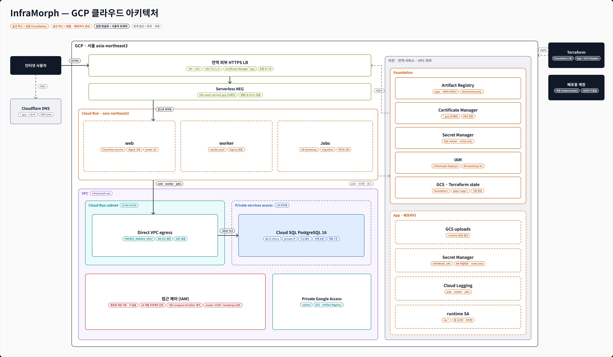

# GCP Terraform

AWS 스택([`terraform/app`](../app), [`terraform/foundation`](../foundation))과 같은 구조를 GCP 서비스로 옮긴다.
Adapter는 `adapters/gcp`, 실제 Control Plane 진입점은 `control_plane/gcp_deploy.py`이며 이 디렉터리는 Terraform 코드를 소유한다.



| AWS | GCP |
|---|---|
| VPC·private subnet·NAT | VPC + Cloud Run Direct VPC egress subnet (NAT 없음) |
| RDS PostgreSQL + RDS 관리 master secret | Cloud SQL PostgreSQL (private IP, TLS 필수) + Secret Manager master secret |
| ECR (immutable) | Artifact Registry `apps` (immutable) + Docker Hub proxy `dockerhub` |
| ECS Fargate service | Cloud Run service (HTTP), Cloud Run worker pool (worker) |
| ECS run-task (bootstrap·migration) | Cloud Run Jobs |
| ALB + ACM + 앱별 listener rule | (선택) 공용 HTTPS LB + Certificate Manager wildcard + serverless NEG URL mask |
| 앱별 IAM execution/task role | 앱별 runtime service account |
| S3 | Cloud Storage |
| CloudWatch Logs | Cloud Logging (Cloud Run 기본 수집) |
| S3 state + `use_lockfile` | GCS state (기본 잠금) |
| AWS profile | `inframorph-deployer` service account impersonation (키 파일 없음) |

## 실행에 필요한 것

| 구분 | 필요한 것 |
|---|---|
| 운영자 PC | `gcloud` CLI 로그인(배포용 계정 가장 권한), Terraform 1.11+, Docker + buildx(linux/amd64) |
| GCP 프로젝트 | 결제 연결, 아래 1번의 API·state 버킷·배포용 계정 |
| Foundation | 2번 적용 완료, 출력 JSON(`terraform output -json`, 권한 600) |
| 도메인 (선택) | DNS에 CNAME 1개(인증서 확인)와 `*.<apps_domain>` A 레코드 1개, 인증서 `ACTIVE` |
| 조종실 | 운영자 설정 JSON(`--gcp-config`): Foundation 출력 경로, project ID, region, gcloud 설정 폴더, `gcloud`·`terraform` 도구 폴더, state 버킷, migration 명령 (`control_plane/gcp_config.py`) |

```sh
.venv/bin/python -m control_plane.runtime --demo --root .local/gcp-runtime \
  --gcp-config /absolute/private/gcp/runtime.json --port 8000
```

화면에서 배포 위치 `GCP`를 고르고 배포한다. 첫 GCP 배포는 앱 전용 리소스를 만들기 때문에 승인 후 진행한다.

## 1. 사전 준비 (최초 1회, 프로젝트 owner)

Terraform state 버킷과 배포용 service account는 Terraform보다 먼저 있어야 한다.

```sh
export PROJECT_ID=<gcp-project-id>
export STATE_BUCKET=<terraform-state-bucket>

gcloud services enable run.googleapis.com artifactregistry.googleapis.com sqladmin.googleapis.com \
  secretmanager.googleapis.com iam.googleapis.com iamcredentials.googleapis.com \
  cloudresourcemanager.googleapis.com servicenetworking.googleapis.com --project "$PROJECT_ID"

gcloud storage buckets create "gs://$STATE_BUCKET" --project "$PROJECT_ID" --location asia-northeast3 \
  --uniform-bucket-level-access --public-access-prevention
gcloud storage buckets update "gs://$STATE_BUCKET" --versioning

gcloud iam service-accounts create inframorph-deployer --project "$PROJECT_ID" \
  --display-name "InfraMorph deployer"

# 운영자 계정이 배포용 계정을 가장(impersonate)할 수 있게 한다. JSON 키는 만들지 않는다.
gcloud iam service-accounts add-iam-policy-binding \
  "inframorph-deployer@$PROJECT_ID.iam.gserviceaccount.com" \
  --member "user:<operator-email>" --role roles/iam.serviceAccountTokenCreator --project "$PROJECT_ID"
```

배포용 계정의 실제 권한은 Foundation이 부여한다(아래 IAM 표). 따라서 Foundation 적용 전에는
배포용 계정으로 앱을 배포할 수 없다.

## 2. Foundation 적용 (프로젝트 owner)

```sh
cp terraform/gcp/foundation/terraform.tfvars.example terraform/gcp/foundation/terraform.tfvars

terraform -chdir=terraform/gcp/foundation init -backend-config="bucket=${STATE_BUCKET}"
terraform -chdir=terraform/gcp/foundation fmt -check
terraform -chdir=terraform/gcp/foundation validate
terraform -chdir=terraform/gcp/foundation plan -out=/tmp/inframorph-gcp-foundation.tfplan
terraform -chdir=terraform/gcp/foundation show /tmp/inframorph-gcp-foundation.tfplan
terraform -chdir=terraform/gcp/foundation apply /tmp/inframorph-gcp-foundation.tfplan
terraform -chdir=terraform/gcp/foundation output -json > /absolute/private/gcp/foundation.outputs.json
```

- `expected_project_number`가 실제 프로젝트 번호와 다르면 plan이 실패한다(AWS `expected_account_id`와 같은 역할).
- Cloud SQL master 비밀번호는 `ephemeral "random_password"`와 write-only 속성으로 Cloud SQL과
  Secret Manager에만 전달되고 Terraform state·plan에는 남지 않는다. 교체는 `db_master_password_version`을 올린다.
- 최초 적용은 약 10분(Cloud SQL 7분, private services access 1분)이다. 앱 배포 시간에는 포함되지 않는다.

### 사용자 도메인 (선택)

`enable_load_balancer = true`, `apps_domain = "<apps_domain>"`으로 적용한 뒤 DNS에 두 레코드를 넣는다.
Cloudflare는 두 레코드 모두 **DNS only**로 둔다. 프록시를 켜면 Cloudflare 인증서가 2단계 와일드카드를 덮지 못한다.

```sh
terraform -chdir=terraform/gcp/foundation output -json certificate_dns_authorization_records  # CNAME
terraform -chdir=terraform/gcp/foundation output -raw lb_ip_address                          # *.<apps_domain> A
gcloud certificate-manager certificates describe inframorph-apps-wildcard --location=global \
  --format="value(managed.state)"                                                           # ACTIVE 확인
```

serverless NEG 하나가 `<service>.<apps_domain>` URL mask로 `<app_id>` 이름의 Cloud Run 서비스로 보낸다.
앱 배포는 LB 리소스를 만들거나 바꾸지 않는다. LB를 끄면 각 앱은 `*.run.app` 주소를 쓴다.
레코드를 넣기 전에 Google이 한 번 확인하면 `CNAME_MISMATCH`로 실패가 기록되지만, 자동 재확인 후 `ACTIVE`가 된다.

## 3. 앱 배포 순서 (Adapter가 배포용 계정으로 실행)

state는 같은 버킷의 `apps/<app_id>` prefix를 쓴다(`-backend-config=prefix=apps/<app_id>`).

1. **preview plan**: 첫 배포는 서비스 없이, 재배포는 실행 중인 서비스를 유지한 값으로 계획한다.
   삭제·교체는 Cloud Run job 교체(실패 후 재시도로 생긴 tainted job)만 허용하고 나머지는 적용 전에 멈춘다.
2. **staging apply**: 첫 배포는 `activate_services=false`라 서비스 없이 runtime SA, secret과 secret version, bucket, job만 만든다.
   재배포는 이전 `service_image_uri`·`service_config`·`service_db_enabled`를 유지하고 migration job만 새 이미지로 바꾼다.
3. `gcloud run jobs execute <bootstrap_job_name> --wait`(첫 DB 배포만), 이어서 `<migration_job_name>`(스키마가 바뀐 경우만).
4. **activation apply**: `activate_services=true`, 새 digest로 서비스·worker pool을 갱신한다.

앱 DB 비밀번호와 `DATABASE_URL`은 staging apply 안에서 Terraform이 secret version으로 만든다.
Cloud Run은 job·서비스를 만들 때 참조한 secret version이 있는지 검사하기 때문이다. 값은 ephemeral·write-only로
전달되어 state에 남지 않으며, 교체는 `database_password_version`을 올린 뒤 bootstrap job이 적용한다.

| 항목 | 규칙 |
|---|---|
| 공개 HTTP 서비스 | `app_id` (LB hostname label) |
| 그 외 서비스·worker pool·job·secret | `resource_prefix`(`im-<slug>-<hash>`)로 시작 |
| runtime service account, bucket | `app_resource_prefix`(`im-`)로 시작 |

## 배포 시간

demo-app V2(web + worker + Cloud SQL + GCS), 조종실 화면 승인 후 GCP 구간 실측:

| 경우 | GCP 구간 | 내역 |
|---|---|---|
| 첫 배포 | 1분 58초 | preview 6초 · push 9초 · staging 30초 · bootstrap+migration job 57초 · activation 15초 · health·smoke 1초 |
| 같은 커밋 재배포 | 43초 | preview 6초 · push 7초 · staging 19초 · DB job 0초(bootstrap·migration 생략) · activation 5초 · health·smoke 1초 |

`feat/a-aws-deploy-speed`에서 실측으로 줄인 대기들을 GCP에서는 구조적으로 없앴다.

| AWS에서 기다리던 것 | GCP |
|---|---|
| ALB 헬스 체크 (15초 → 5초 간격) | HTTP startup probe 1초 간격 + startup CPU boost |
| 대상 deregistration·옛 task 종료(30초 → 5초, SIGTERM 30초) | 새 revision이 준비되면 즉시 트래픽 전환, 옛 인스턴스 종료를 기다리지 않음 |
| 앱별 target group·listener rule 생성 | 앱별 LB 리소스 없음 (Foundation NEG URL mask) |
| Fargate DB task ENI 정리 (15~30초) | Cloud Run job은 컨테이너 종료 시 완료, `max_retries = 0` |
| 이미지 pull | 같은 리전 Artifact Registry, bootstrap 이미지도 리전 내 proxy |
| 공개 접근 IAM 반영 대기 | `invoker_iam_disabled`로 IAM 바인딩 없이 공개 |
| 배포마다 모든 리소스 태그 갱신 | 커밋 라벨은 Cloud Run 리소스에만, secret·bucket·bootstrap job은 재배포 때 변경 없음 |
| - | Direct VPC egress는 DB를 쓰는 앱에만 연결 |

## 배포용 계정 IAM (Foundation이 부여)

| 범위 | 역할 |
|---|---|
| 프로젝트 | `run.admin`, `iam.serviceAccountCreator`, `iam.serviceAccountAdmin`, `iam.serviceAccountUser`, `logging.viewer`, `serviceusage.serviceUsageConsumer` |
| `im-*` 리소스만 (IAM 조건) | `secretmanager.admin`, `storage.admin` |
| state 버킷의 `apps/` 아래만 | `storage.objectAdmin` |
| `apps` 저장소 | `artifactregistry.writer` |
| `dockerhub` proxy | `artifactregistry.reader` (job 생성 시 Cloud Run이 호출자의 이미지 읽기 권한을 확인) |
| Cloud Run subnet | `compute.networkUser` |
| DB bootstrap SA | `iam.serviceAccountUser` |

- master secret은 DB bootstrap SA만 읽는다. 배포용 계정과 앱 runtime SA는 읽지 못한다.
- service account 역할은 이름 조건으로 좁힐 수 없다. IAM이 service account를 숫자 unique ID로 평가해
  `im-` 이메일 조건이 항상 거부된다(실제 배포로 확인). 그래서 프로젝트 단위로 주고, 가장할 수 있게 되는
  유일한 강한 계정인 기본 Compute service account의 `roles/editor`를 Foundation이 먼저 제거한다
  (`remove_default_compute_editor`, 제거가 끝난 뒤에만 권한 부여).
- secret·bucket 조건은 이름(`projects/<number>/secrets/im-…`, `projects/_/buckets/im-…`)으로 평가되어 정상 동작한다.

## 검증

```sh
terraform -chdir=terraform/gcp/foundation init -backend=false && terraform -chdir=terraform/gcp/foundation test
terraform -chdir=terraform/gcp/app init -backend=false && terraform -chdir=terraform/gcp/app test
.venv/bin/python -m unittest discover -s adapters/gcp/tests
```

테스트는 로컬 `terraform.tfvars`에 영향받지 않도록 LB 관련 변수를 직접 지정한다.

## 커밋하지 않는 파일과 값

- `.terraform/`, state, plan, 실제 `terraform.tfvars`, backend 설정 파일, Foundation 출력 JSON
- 실제 project ID·번호, 도메인, 버킷, IP, service account 이메일, secret 값
- service account JSON 키 (만들지 않는다)

`.terraform.lock.hcl`과 `terraform.tfvars.example`은 커밋한다. Foundation 제거 시에는 앱별 리소스를 먼저
제거하고, Cloud SQL 데이터·백업과 Artifact Registry 이미지 보존 여부를 별도로 승인받은 뒤 destroy plan을 검토한다.
